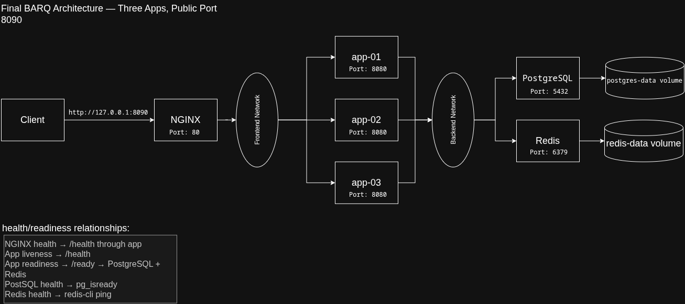

# Final architecture

The diagram describes the required final state after the recorded live change: three Flask
instances behind NGINX, exposed only on host loopback port 8090. The diagram was prepared from
`2026-09-13 18:25:41 EEST (+0300)` / `15:25:41 UTC` to `18:52:04 EEST (+0300)` /
`15:52:04 UTC`.

## Request flow and networks

Client requests enter through `127.0.0.1:8090` and reach NGINX on container port 80. NGINX
load-balances requests across the Flask instances `app-01`, `app-02`, and `app-03` on port 8080
over the frontend network. The apps also join the internal backend network and connect to
PostgreSQL on port 5432 and Redis on port 6379. NGINX has no backend-network membership or
direct path to either data service.

## Storage and health

PostgreSQL stores data in the `postgres-data` named volume. Redis stores its AOF data in the
`redis-data` named volume. App `/health` reports process liveness, while `/ready` checks both
PostgreSQL and Redis. PostgreSQL uses `pg_isready`, Redis uses `redis-cli ping`, and the NGINX
health check requests `/health` through the proxied application path.

## Remaining single points of failure

Three Flask instances provide application-tier redundancy, but one NGINX container, one
PostgreSQL instance, one Redis instance, their local named volumes, and the single Docker host
remain single points of failure. A production design would require redundant ingress,
replicated data services, and storage independent of one host.
